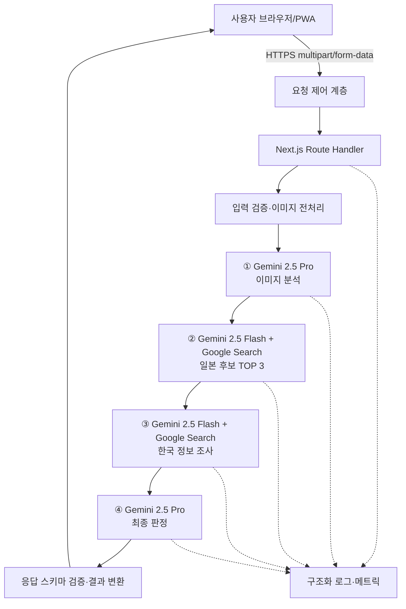

# MangaFind V1 아키텍처

## 1. 문서 목적

이 문서는 MangaFind V1의 논리 아키텍처와 런타임 데이터 흐름을 정의한다. PRD의 제품 요구사항을 구현 가능한 책임 경계로 변환하며, 구체적인 SDK 버전·환경변수 이름·Docker 명령·Azure 리소스 설정은 TRD에서 정의한다.

## 2. 아키텍처 목표

- 이미지 1~3장으로 일본 만화 후보 TOP 3을 검색한다.
- 이미지 추측과 웹 검색을 분리한다.
- 일본 검색과 한국 정보 검색의 결과를 최종 판정 모델이 통합한다.
- Gemini API 키와 검색 원문을 브라우저에 노출하지 않는다.
- 사용자 이미지를 영구 저장하지 않는다.
- 기본 요청을 4회 모델 호출과 전체 60초 예산 안에서 처리한다.
- 외부 모델의 자유 형식 응답을 내부 타입으로 검증한 뒤 다음 단계로 전달한다.

## 3. V1 범위와 제약

### 3.1 포함

- Next.js 서버와 모바일 우선 PWA
- `POST /api/identify` 동기식 API
- Gemini 2.5 Pro 이미지 분석
- Gemini 2.5 Flash + `google_search` 일본 작품 검색
- Gemini 2.5 Flash + `google_search` 한국 정보 검색
- Gemini 2.5 Pro 최종 판정
- 이미지 원본 비영구 저장
- Docker 및 Azure Container Apps 배포

### 3.2 제외

- 회원·로그인·검색 기록·찜
- 영구 DB와 사용자 이미지 저장소
- 별도 OCR 모델과 자체 검색엔진
- 복잡한 크롤링과 대체 검색 API
- 비동기 작업 큐와 작업 상태 조회 API
- 사용자에게 웹 출처 목록을 표시하는 기능

### 3.3 기술 스택과 언어 영역

MangaFind V1은 애플리케이션 계층을 TypeScript로 통일한다. 브라우저와 서버가 동일한 언어와 도메인 타입을 공유해 API 계약 불일치를 줄인다.

| 영역 | 언어·기술 | 책임 |
|---|---|---|
| 웹 UI | TypeScript + React | 업로드, 로딩 상태, 결과·오류·부분 성공 화면 |
| 웹 프레임워크 | Next.js App Router | 페이지 라우팅, 서버 렌더링, Route Handler |
| 스타일링 | CSS와 Tailwind CSS | 반응형 모바일 UI, PWA 화면 스타일 |
| 서버 런타임 | TypeScript + Node.js | HTTP 처리, 파이프라인 오케스트레이션, 외부 API 호출 |
| AI 연동 | TypeScript Gemini SDK 또는 REST | Gemini 2.5 Pro/Flash 호출과 Search 도구 사용 |
| 데이터 계약 | TypeScript 타입 + JSON Schema 검증 | 단계별 모델 출력과 공개 API 응답 검증 |
| 이미지 처리 | Node.js에서 호출하는 이미지 처리 모듈 | MIME·픽셀·디코딩 검증, EXIF 제거, 임시 버퍼 생성 |
| 테스트 | TypeScript | 단위·통합·API 계약·브라우저 E2E 테스트 |
| 배포 정의 | Dockerfile·Azure 설정 파일 | Node.js 프로덕션 컨테이너와 Azure Container Apps 배포 |

#### 언어별 사용 원칙

- TypeScript를 프론트엔드, Route Handler, AI 파이프라인, 검증 모듈의 기본 구현 언어로 사용한다.
- 브라우저 전용 코드는 React 컴포넌트와 TypeScript로 작성하며, API 키나 서버 전용 모듈을 클라이언트 번들에 포함하지 않는다.
- 서버 전용 코드는 Node.js 실행 환경을 전제로 하며, 파일 시스템·환경변수·Gemini 인증 정보는 서버 모듈에서만 접근한다.
- React 컴포넌트와 서버 모듈 사이에는 공유 타입만 전달하고, 서버 전용 SDK 타입이나 원시 Gemini 응답을 UI에 노출하지 않는다.
- 모델 응답은 `unknown` 또는 외부 SDK 타입에서 내부 도메인 타입으로 변환한 뒤 사용한다. 무검증 `any`와 자유 형식 문자열을 단계 간 계약으로 사용하지 않는다.
- 프롬프트 텍스트는 별도 서버 모듈에 두고, 프롬프트가 기대하는 JSON Schema와 함께 버전 관리한다.
- Python, 별도 OCR 언어·런타임, 별도 검색 서버는 V1에서 사용하지 않는다.

#### 계층별 코드 경계

```text
MangaFind/
├─ azure.yaml                         AZD 서비스 연결
├─ Dockerfile                          Next.js 프로덕션 이미지
├─ package.json                        의존성·스크립트
├─ next.config.*                       Next.js 설정
├─ src/
│  ├─ app/                             페이지·Route Handler
│  │  ├─ page.tsx                      Website/PWA 검색 홈
│  │  ├─ layout.tsx                    공통 레이아웃·메타데이터
│  │  ├─ globals.css                   전역 스타일·디자인 토큰
│  │  └─ api/
│  │     ├─ health/route.ts            실행 상태 확인
│  │     └─ identify/route.ts           식별 API 진입점
│  ├─ components/                      업로드·분석·결과 UI
│  │  ├─ upload/                       이미지 선택·미리보기
│  │  ├─ analysis/                     분석 단계 표시
│  │  └─ results/                      후보·성공·부분 성공·오류 표시
│  └─ lib/
│     ├─ domain/                       도메인 타입·상태 매핑
│     ├─ pipeline/                     ①→②→③→④ 실행 흐름
│     ├─ ai/                           Gemini 호출 어댑터·프롬프트
│     ├─ validation/                   이미지·외부 응답 검증
│     └─ observability/                요청 ID·로그·메트릭
├─ tests/                              단위·통합·계약 테스트
├─ e2e/                                브라우저 E2E 테스트
├─ infra/                              Azure 배포 리소스·권한
└─ .azure/                             AZD 배포 계획·환경 상태
```

`src/app`, `src/components`, `src/lib`는 애플리케이션 내부 책임 경계다. 이 폴더들을 별도 컨테이너나 AZD 서비스로 분리하지 않으며 Website와 PWA는 하나의 Next.js 앱으로 배포한다.

구체적인 Node.js, Next.js, TypeScript, Gemini SDK, 이미지 처리 라이브러리 버전과 패키지 선택은 TRD에서 확정한다.

### 3.4 애플리케이션과 배포 서비스의 경계

Website Experience와 PWA App Experience는 하나의 Next.js 애플리케이션 안에 둔다. 화면 목적과 진입 방식은 다르지만 업로드 상태, 결과 타입, `/api/identify` 계약과 서버 파이프라인을 공유해야 한다.

배포 단위도 하나의 AZD 애플리케이션 서비스로 유지한다.

`src/app`, `src/components`, `src/lib`는 코드 책임 경계이지 컨테이너나 AZD 서비스 경계가 아니다. 이 구분을 유지하면 초기 스캐폴딩 배포 뒤 AI 모듈과 화면을 추가해도 `azure.yaml`의 서비스 매핑을 변경할 필요가 없다.

## 4. 논리 구성



### 4.1 요청 제어 계층

논리적으로 다음 기능을 담당한다.

- HTTPS 종료와 기본 요청 크기 제한
- IP 기준 분당 3회·일 30회 요청 제한
- 동시 처리 요청 제한
- `Retry-After`가 포함된 HTTP 429 응답
- 요청 ID 생성과 단계별 측정 시작

이 계층은 MangaFind의 비즈니스 DB가 아니다. V1에서 강한 분산 rate limit이 필요하면 Azure API Management 또는 별도 제한 저장소를 사용하고, 단순한 단일 인스턴스 메모리 제한은 운영 한계가 있음을 TRD에 기록한다.

### 4.2 Next.js Route Handler

Route Handler는 HTTP 오케스트레이션만 담당한다.

- multipart 요청 수신
- 요청 제어 계층 통과 여부 확인
- 이미지 검증 모듈 호출
- 식별 파이프라인 호출
- 내부 결과를 공개 응답으로 변환
- 민감한 외부 오류를 사용자 오류로 매핑

모델 프롬프트와 후보 판정 규칙을 Route Handler 안에 직접 작성하지 않는다.

스캐폴딩 단계에서는 `GET /api/health`를 프로세스 생존 확인용으로 제공하고, `POST /api/identify`는 기능 구현 전까지 임시 501 응답을 반환할 수 있다. health는 Gemini나 Key Vault에 연결하지 않으며, 실제 식별 기능이 완성되면 identify Route Handler가 파이프라인 오케스트레이터를 호출한다. 이 임시 동작은 최종 공개 API 계약에 포함하지 않는다.

### 4.3 이미지 검증·전처리 모듈

신뢰 경계에서 다음 순서로 처리한다.

1. 이미지 개수 1~3장 확인
2. 요청 파일 크기 확인
3. 매직 바이트와 실제 MIME 확인
4. 안전한 이미지 디코딩과 손상 여부 확인
5. 가로·세로 및 총 픽셀 수 확인
6. EXIF 등 불필요한 메타데이터 제거
7. Gemini 입력용 임시 버퍼 생성

모든 이미지가 유효해야 ①을 호출한다. 파일당 최대 10MB, 가로·세로 최대 8192px, 이미지당 최대 64MP를 적용한다. 구체적인 디코더와 재인코딩 방식은 TRD에서 정한다.

### 4.4 식별 파이프라인 오케스트레이터

파이프라인은 다음 독립 함수로 나눈다.

```text
validateAndPrepareImages
→ analyzeImages
→ searchJapaneseCandidates
→ searchKoreanInformation
→ judgeCandidates
→ validateAndMapResponse
```

각 함수는 HTTP 객체를 직접 다루지 않고, 명시된 입력 타입과 출력 타입을 사용한다. 각 단계의 원시 모델 응답은 다음 단계로 직접 전달하지 않고 스키마 검증을 통과한 내부 객체로 변환한다.

## 5. 단계별 설계

### 5.1 ① 이미지 분석: Gemini 2.5 Pro

입력:

- 전처리된 이미지 1~3장
- 이미지별 식별 단서 추출 프롬프트

출력 개념:

```json
{
	"japaneseTexts": [],
	"suspectedTitles": [],
	"characterNames": [],
	"authorClues": [],
	"publisherClues": [],
	"serializationClues": [],
	"visualClues": [],
	"imageStatuses": []
}
```

책임:

- OCR과 시각 단서 추출
- 이미지별 단서와 전체 통합 단서 구분
- 작품을 확정하지 않음
- 검색어를 최종 확정하지 않음

실패:

- 단서가 없으면 `imageAnalysis = INSUFFICIENT`
- 모델 응답 검증 실패나 외부 오류면 `FAILED`
- 다음 단계는 `SKIPPED`

### 5.2 ② 일본 작품 검색: Gemini 2.5 Flash + Google Search

입력:

- ①의 검증된 이미지 분석 JSON
- 일본어 대사·인물명·추정 제목 기반 검색 프롬프트

처리:

- 검색어를 생성한다.
- `google_search` 도구를 사용한다.
- 검색 결과를 후보별로 요약한다.
- 근거 enum과 후보 판정 수준을 부여한다.

출력:

```json
{
	"candidates": [
		{
			"rank": 1,
			"japaneseTitle": "...",
			"author": "...",
			"confidence": "HIGH",
			"evidence": ["DIALOGUE_MATCH"],
			"searchSupport": []
		}
	]
}
```

후보는 최대 3개이며 근거가 없는 후보는 제거한다. 검색 원문 전체가 아니라 최종 판정에 필요한 요약과 내부 인용 메타데이터만 보존한다.

### 5.3 ③ 한국 정보 검색: Gemini 2.5 Flash + Google Search

입력:

- ②의 일본 작품 후보 TOP 3
- 후보별 일본 원제와 작가
- 한국 공식 제목·통용명·정발 여부 조사 프롬프트

처리:

- TOP 3 후보를 한 번의 Gemini 호출에서 후보별로 조사한다.
- `google_search` 도구를 사용한다.
- 공식 제목, 통용명, AI 참고 번역, 정발 상태를 후보별로 분리한다.
- 공식 출처·판매 정보가 없으면 확정하지 않는다.

출력 개념:

```json
{
	"candidateResults": [
		{
			"rank": 1,
			"koreanTitle": null,
			"koreanTitleStatus": "UNKNOWN",
			"publicationStatus": "UNKNOWN",
			"investigationStatus": "TIMEOUT",
			"searchSupport": []
		}
	]
}
```

한 후보의 조사 실패가 다른 후보의 결과를 무효화하지 않는다. 후보별 한국 정보가 모두 완료되면 단계는 `SUCCESS`, 일부만 완료되면 `PARTIAL`, 결과가 없으면 `INSUFFICIENT`, 외부 오류면 `FAILED`, 제한 시간 초과면 `TIMEOUT`이다.

### 5.4 ④ 최종 판정: Gemini 2.5 Pro

입력:

- ①의 구조화된 이미지 분석 JSON
- ②의 후보 TOP 3
- ③의 후보별 한국 정보 또는 한국 정보 조사 실패 상태
- 검색 결과에서 추출한 내부 근거 메타데이터

원본 이미지는 ④에 다시 전달하지 않는다. ④는 `google_search`를 사용하지 않는다.

책임:

- ② 후보와 ③ 한국 정보를 연결한다.
- 충돌하는 후보의 순위를 재평가한다.
- 근거가 없는 주장을 제거한다.
- 최종 `HIGH`, `MEDIUM`, `LOW`를 결정한다.
- 한국어 제목 상태와 정발 상태 조합을 검증한다.

④는 새로운 후보를 검색하지 않는다. ③이 `INSUFFICIENT`, `FAILED`, `TIMEOUT` 또는 전체 `PARTIAL`이어도 ②의 후보 TOP 3과 ①의 이미지 단서가 있으면 실행한다. 이때 한국 정보 입력은 비어 있거나 후보별 `UNKNOWN` 상태로 전달한다.

④가 성공하면 일본 작품 후보와 판단 근거를 반환하고, 최상위 상태는 `PARTIAL_SUCCESS`로 설정한다. 한국어 제목과 정발 여부는 조사되지 않은 후보마다 `UNKNOWN`으로 유지한다. ④ 자체가 timeout이거나 응답 검증에 실패하면 최상위 상태는 `FAILED`이며 후보를 반환하지 않는다.

## 6. 상태 및 실패 전파

### 6.1 단계 상태

단계 상태는 다음 enum을 사용한다.

- `SUCCESS`: 해당 단계 완료
- `PARTIAL`: 후보별 결과 중 일부만 완료
- `INSUFFICIENT`: 입력 단서 또는 검색 정보 부족
- `FAILED`: 외부 오류 또는 응답 검증 실패
- `TIMEOUT`: 12초 단계 예산 초과
- `SKIPPED`: 선행 단계 실패로 실행하지 않음

### 6.2 최상위 상태 매핑

| 조건 | 최상위 상태 | 후보 반환 |
|---|---|---|
| ①·②·③·④ 모두 성공 | `SUCCESS` | TOP 1~3 |
| ② 성공, ③이 `PARTIAL`·`INSUFFICIENT`·`FAILED`·`TIMEOUT`, ④ 성공 | `PARTIAL_SUCCESS` | 일본 후보 TOP 1~3 |
| ①이 `INSUFFICIENT` 또는 ②가 `INSUFFICIENT` | `INSUFFICIENT` | 빈 배열 |
| ①·②가 외부 오류·검증 실패·timeout | `FAILED` | 빈 배열 |
| ② 성공, ③ 실패, ④ 외부 오류·검증 실패·timeout | `FAILED` | 빈 배열 |

③이 실패해도 ④를 `SKIPPED`로 처리하지 않는다. ④는 한국 정보 필드가 없는 일본 후보 판정 모드로 실행한다.

④ 응답 검증이 실패하면 이전 단계의 원시 결과를 사용자에게 직접 반환하지 않는다. 오류 상태와 재시도 안내만 반환한다.

### 6.3 후보별 nullable 규칙

- `SUCCESS`: `koreanTitle`은 문자열이며 필드를 생략하지 않는다.
- `PARTIAL_SUCCESS`: 한국 정보 조사가 성공한 후보는 조사 결과를 사용하고, 실패한 후보의 `koreanTitle`은 `null`, `koreanTitleStatus`와 `publicationStatus`는 `UNKNOWN`이다.
- `TRANSLATED`: `koreanTitle`은 AI 참고 번역 문자열이며 UI에 AI 번역 표시를 붙인다.
- `UNKNOWN`: `koreanTitle`은 `null`이며 UI에 확인 불충분을 표시한다.

## 7. 데이터 수명과 저장

### 7.1 요청 내부 데이터

다음 데이터는 한 요청의 처리 컨텍스트에서만 유지한다.

- 전처리된 이미지 버퍼
- ①~③의 구조화 결과
- 검색 요약과 내부 인용 메타데이터
- 요청 ID와 단계별 시간 측정값

### 7.2 삭제 원칙

- 원본과 전처리 이미지 모두 요청 종료 시 즉시 삭제한다.
- 성공·실패·timeout·예외 모든 경로에서 삭제한다.
- 이미지 본문과 검색 원문은 로그에 기록하지 않는다.
- V1에서는 결과와 검색 기록을 DB에 저장하지 않는다.

요청 ID, 단계 상태, 처리 시간, 토큰 사용량 같은 최소 운영 메트릭은 이미지나 검색 원문과 분리해 기록할 수 있다.

## 8. 보안 경계

### 8.1 브라우저와 서버

- 브라우저는 MangaFind 서버만 호출한다.
- Gemini API 키와 Google Search 도구 설정은 서버에만 둔다.
- 클라이언트 검증은 UX용이며 서버 검증을 대체하지 않는다.

### 8.2 외부 모델과 검색 결과

- Gemini 응답과 검색 결과는 신뢰하지 않는 외부 데이터로 취급한다.
- JSON Schema 검증 후 내부 로직에 사용한다.
- 모델이 반환한 URL이나 HTML을 그대로 렌더링하지 않는다.
- 검색 결과의 사용자 표시가 없더라도 내부 데이터는 허용 목록 필드만 저장한다.

### 8.3 개인정보

- 업로드 전 외부 AI 전송 안내를 표시한다.
- EXIF 등 메타데이터를 제거한 뒤 모델에 전달한다.
- API 키, 이미지, 개인정보가 로그에 남지 않게 한다.

## 9. 시간·비용·관측 설계

### 9.1 시간 예산

| 구간 | 예산 |
|---|---:|
| ① 이미지 분석 | 12초 |
| ② 일본 검색 | 12초 |
| ③ 한국 검색 | 12초 |
| ④ 최종 판정 | 12초 |
| 업로드 검증·응답·네트워크 여유 | 12초 |
| 전체 | 60초 |

서버 자동 재시도는 하지 않는다. 외부 오류나 timeout은 해당 단계 상태로 기록하고 요청을 종료한다.

### 9.2 호출 및 비용 모델

정상 요청의 기본 호출 수는 다음과 같다.

- Pro 이미지 분석 1회
- Flash 일본 검색 1회
- Flash 한국 검색 1회
- Pro 최종 판정 1회

측정값:

- 모델별 입력·출력 토큰
- Search 도구 사용 여부와 호출 메타데이터
- 단계별 latency와 전체 latency
- 성공·부분 성공·정보 부족·실패 비율
- 요청당 평균·최대 비용

### 9.3 관측 이벤트

모든 이벤트에 요청 ID를 연결한다.

- `identify_started`
- `image_validation_completed`
- `stage_completed`
- `stage_failed`
- `identify_completed`
- `identify_rejected`

이벤트에 이미지 본문, 검색 원문, API 키, 내부 프롬프트를 포함하지 않는다.

## 10. 배포 논리

```text
Browser/PWA
		↓ HTTPS
Azure API Management
		├─ 외부 공개: /api/identify
		├─ IP rate limit
		├─ request size·CORS·Retry-After 정책
		└─ request ID 전달
		↓ backend
Azure Container Apps
		└─ Next.js container
			├─ /api/health (probe·내부 확인)
			├─ request control 보조 처리
			├─ image validation
			└─ identification pipeline
					 ↓
				Gemini API

Container App Managed Identity
		↓
Azure Key Vault
		↓ 서버 전용 Gemini Secret
```

- 컨테이너는 요청 처리 상태를 영구 보관하지 않는 stateless 서비스로 설계한다.
- Gemini API 키는 이미지나 코드에 포함하지 않고 배포 환경 Secret으로 주입한다.
- 로그와 메트릭은 이미지·검색 원문과 분리한다.
- V1은 단일 동기 요청 모델이며, 큐·worker·작업 저장소는 V2 후보다.
- 초기 스캐폴딩 배포부터 Container Registry, Container Apps, Managed Identity, Key Vault, Application Insights, API Management의 논리적 경계를 유지한다.
- 초기 스캐폴딩은 Gemini 호출 없이 `/api/health`가 성공해야 하며, 기능 구현 후에는 같은 Container App revision 흐름에 AI 파이프라인을 추가한다.
- APIM과 Container Apps의 backend timeout은 애플리케이션 전체 60초 deadline보다 짧지 않아야 한다. 각 모델 단계의 12초 timeout과 Gateway 정책 지연은 별도로 측정한다.
- `azd up` 반복 시 AZD 서비스 이름, Docker context, 공개 API 경로, Secret 이름, 인프라 출력값의 의미를 변경하지 않는다.

## 11. TRD로 넘길 결정

- Next.js·Node.js·Gemini SDK 버전
- Gemini API 호출 방식과 구조화 출력 구현
- 각 단계 JSON Schema와 Zod 타입
- 이미지 디코딩·EXIF 제거 라이브러리
- 요청 크기 제한과 multipart 파서
- rate limit 구현 위치와 저장소
- Azure Container Apps CPU·메모리·replica·ingress 설정
- Secret과 Application Insights 설정
- 단위·통합·E2E 테스트 도구
- 30건 벤치마크 실행 스크립트와 비용 계산 방식

